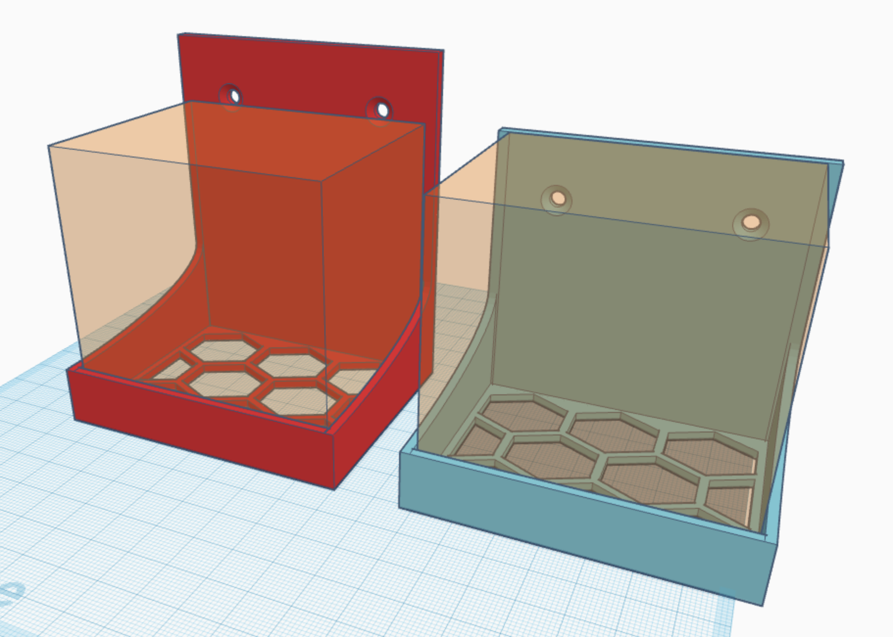
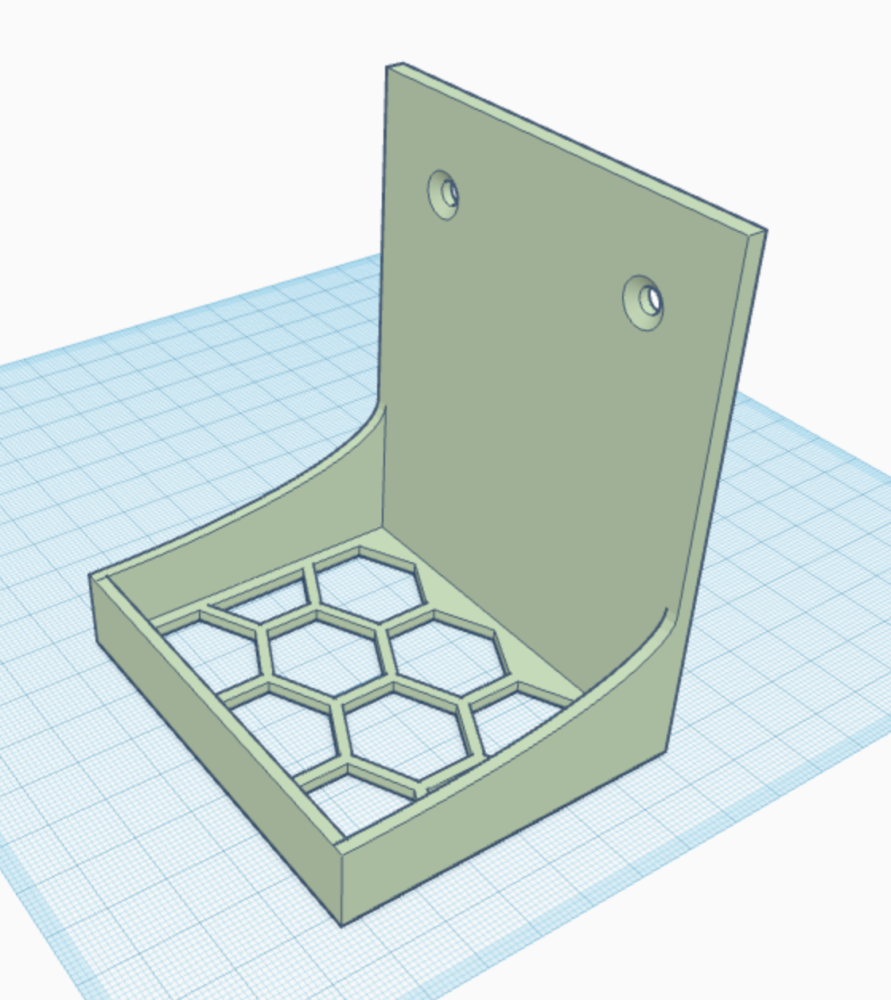

# Wall Mount Emergency Stop Holder

A wall mount emergency stop holder!

Suits emergency stops which are 58mm x 72mm x 72mm in size.

## Two Models

- Tall (red) = 92mm tall
- Short (light blue) = 75mm tall, screws will be hidden behind emergency stop

## Mounting

- Use two 3mm wood screws.

## Print Orientation

